# ThoughtLink — Results Index

Navigable index of every empirical result in this repository. The tables in
this document are auto-generated from canonical JSON / CSV artifacts in
[`results/`](../results/); to regenerate after a new training or ablation run:

```bash
uv run python scripts/build_results_doc.py
```

The script rewrites only the sections marked with
`<!-- BEGIN: name --> ... <!-- END: name -->`; the surrounding prose is
hand-written and preserved across regenerations. To verify the doc is in
sync with the data (CI-friendly):

```bash
uv run python scripts/build_results_doc.py --check
```

> Why a generated doc rather than embedded tables in the long-form writeups?
> The canonical numbers live in JSON/CSV (single source of truth, easily
> consumable by other tools); this index is just a human-friendly view.
> See [`docs/research/guardrails.md`](research/guardrails.md) for the full
> methodology and discussion behind the v1.1 guardrails layer.

## Dataset

Data come from the
[`KernelCo/robot_control`](https://huggingface.co/datasets/KernelCo/robot_control)
HuggingFace dataset. Sliding-window augmentation expands each `.npz` chunk
into ~15 windows (1 s, 50 % overlap).

<!-- BEGIN: dataset_summary -->

| Property | Value |
|---|---:|
| Total samples (.npz files) | 900 |
| Train samples | 810 |
| Test samples | 90 |
| Train windows | 12150 |
| Test windows | 1350 |
| # features (standard set) | 66 |
| # train subjects | 5 |
| # test subjects | 1 |
<!-- END: dataset_summary -->

The split above is the one used by the v1.0 analysis script
(6 subjects total: 5 train / 1 test). The v1.1 ablation harness uses a
larger 3-way split with 17 subjects (12 train / 2 calibration / 3 test)
— see [`docs/research/guardrails.md`](research/guardrails.md) §6.

## Baseline models (v0.3.0)

Four sklearn baselines on the standard 66-feature set (band power + Hjorth +
time-domain). Source: [`results/baseline_results.json`](../results/baseline_results.json),
[`results/analysis_summary.json`](../results/analysis_summary.json).

<!-- BEGIN: baseline_table -->

Multiclass test-set metrics (5 classes, hold-out subject):

| Model | Accuracy | Kappa | F1 macro | Latency (ms) |
|---|---:|---:|---:|---:|
| logreg | 0.226 | 0.032 | 0.201 | 0.049 |
| svm_linear | 0.250 | 0.062 | 0.224 | 0.220 |
| svm_rbf | 0.188 | -0.015 | 0.191 | 0.509 |
| random_forest | 0.209 | 0.011 | 0.197 | 3.170 |

Binary rest-vs-active accuracy (sanity check):

| Model | Accuracy | Kappa |
|---|---:|---:|
| logreg | 0.473 | -0.054 |
| svm_linear | 0.500 | 0.000 |
| svm_rbf | 0.556 | 0.111 |
| random_forest | 0.509 | 0.017 |
<!-- END: baseline_table -->

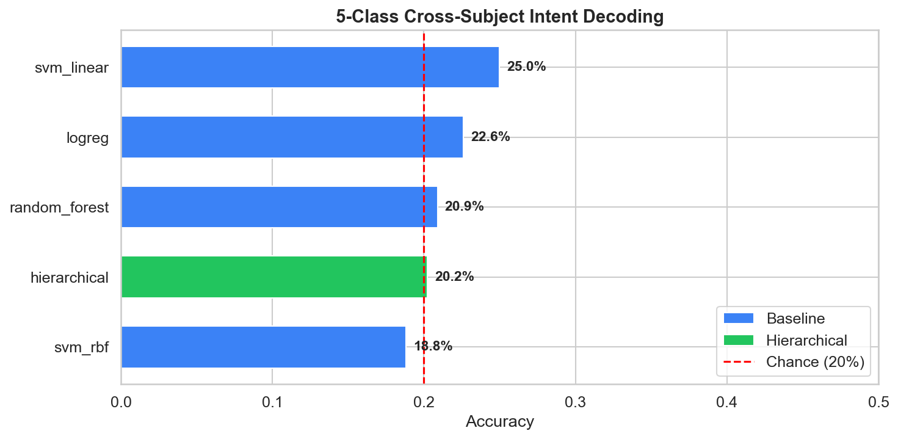
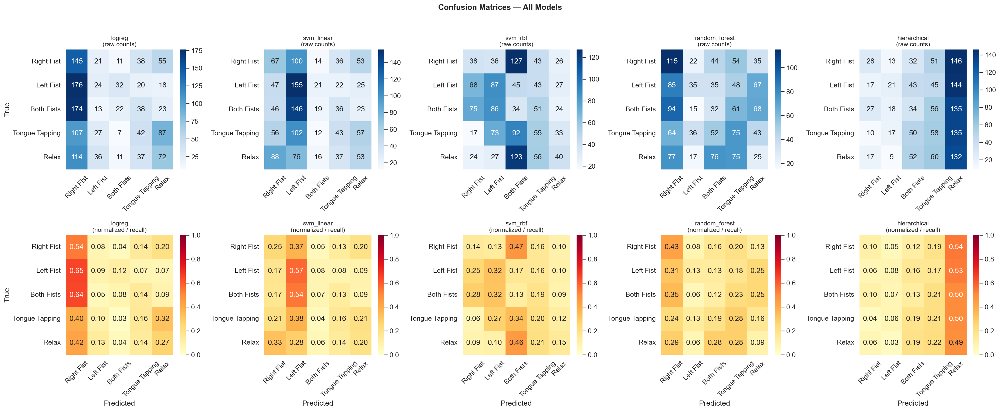
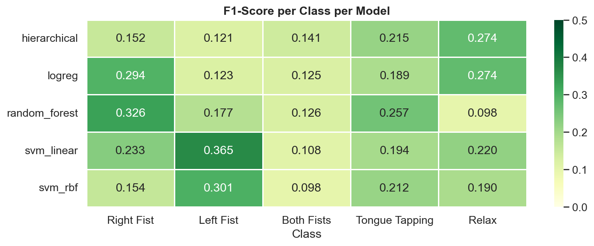
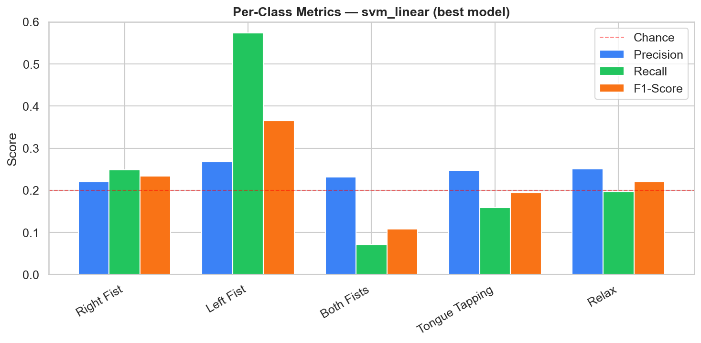
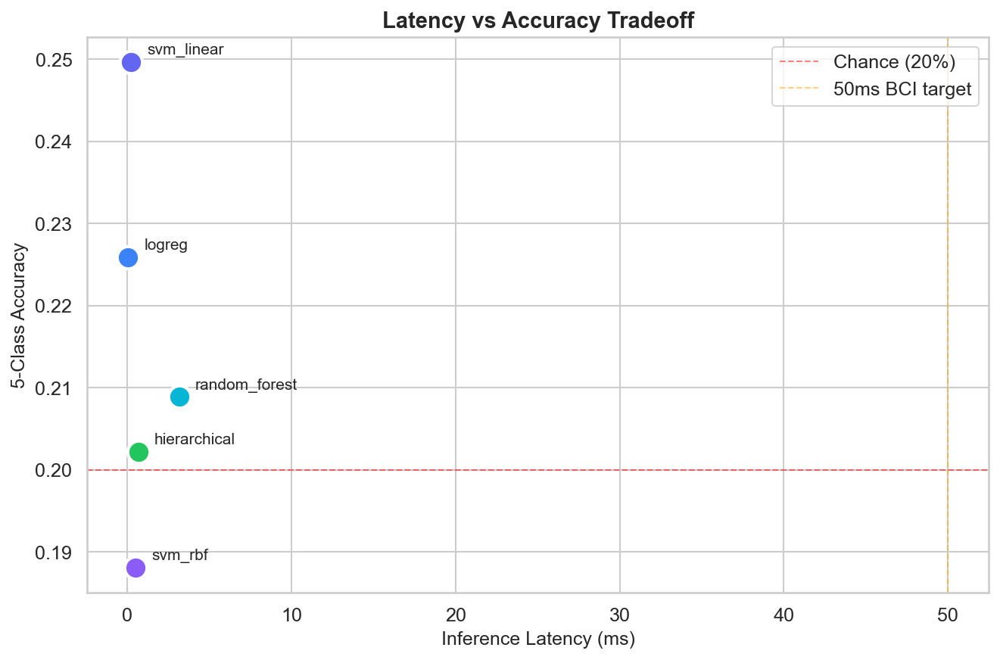

## Hierarchical 2-stage classifier (v0.3.0)

Two-stage cascade: Stage 1 binary rest/active gate, then Stage 2 four-class
decoder among the active labels. Designed to keep the false-trigger rate
low so a robot does not act on noise. Source:
[`results/hierarchical_results.json`](../results/hierarchical_results.json).

<!-- BEGIN: hierarchical_table -->

| Metric | Value |
|---|---:|
| Stage 1 accuracy (rest vs active) | 0.777 |
| Full pipeline accuracy (5 classes) | 0.265 |
| Cohen's kappa | 0.081 |
| False-trigger rate | 0.654 |
| Missed-active rate (analysis split) | 0.519 |
<!-- END: hierarchical_table -->

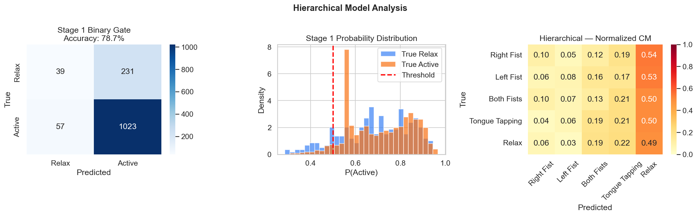
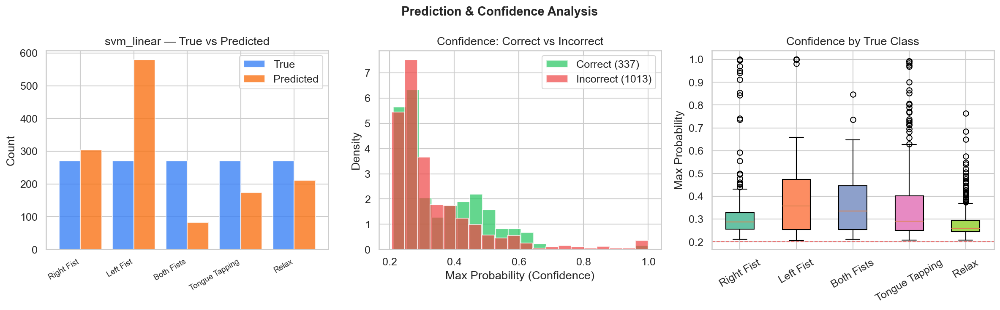

## EEGNet CNN (v1.0.0)

Compact convolutional architecture (Lawhern et al. 2018) trained on raw
EEG windows with channel/time augmentation. Source:
[`results/cnn_results.json`](../results/cnn_results.json).

<!-- BEGIN: cnn_table -->

**Headline metrics**

| Metric | Value |
|---|---:|
| Accuracy | 0.235 |
| Kappa | 0.043 |
| # parameters | 5317 |
| Epochs trained | 100 |
| Best epoch accuracy | 0.235 |

**Per-class** (test set)

| Class | Precision | Recall | F1 | Support |
|---|---:|---:|---:|---:|
| Right Fist | 0.225 | 0.133 | 0.167 | 405 |
| Left Fist | 0.210 | 0.094 | 0.130 | 405 |
| Both Fists | 0.314 | 0.133 | 0.187 | 405 |
| Tongue Tapping | 0.223 | 0.669 | 0.334 | 405 |
| Relax | 0.269 | 0.143 | 0.187 | 405 |
<!-- END: cnn_table -->

## Wavelet study (v0.5.0)

Augments the 66-feature standard set with DWT (Discrete Wavelet Transform)
coefficients (138 features total). Source:
[`results/wavelet_vs_standard_comparison.json`](../results/wavelet_vs_standard_comparison.json),
[`results/wavelet_results.json`](../results/wavelet_results.json),
[`results/wavelet_analysis_summary.json`](../results/wavelet_analysis_summary.json).

<!-- BEGIN: wavelet_table -->

Standard set: 66 features. Wavelet set: 138 features (DWT-augmented).

| Model | Standard acc | Wavelet acc | Δ acc | Standard F1 | Wavelet F1 | Δ F1 |
|---|---:|---:|---:|---:|---:|---:|
| logreg | 0.226 | 0.173 | -0.053 | 0.201 | 0.160 | -0.041 |
| svm_linear | 0.250 | 0.207 | -0.042 | 0.224 | 0.192 | -0.032 |
| svm_rbf | 0.188 | 0.218 | 0.030 | 0.191 | 0.185 | -0.006 |
| random_forest | 0.209 | 0.243 | 0.034 | 0.197 | 0.232 | 0.035 |
| hierarchical | 0.202 | 0.201 | -0.001 | 0.181 | 0.161 | -0.020 |
<!-- END: wavelet_table -->

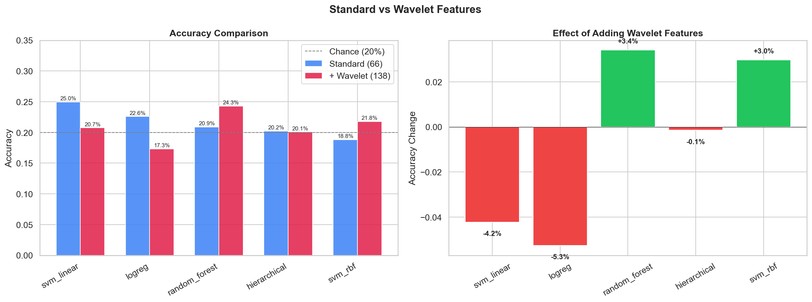
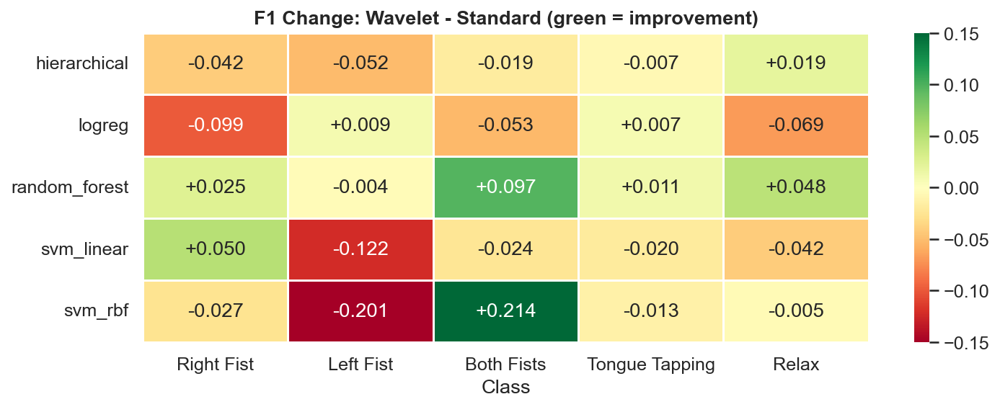
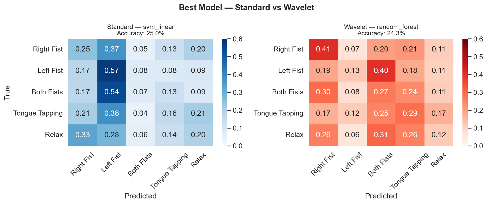
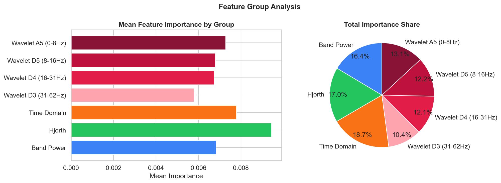

## Calibration & conformal (v1.1.0)

Single-split snapshot of the post-hoc guardrails layer (calibrators +
APS conformal predictor at α = 0.1). For the full methodology, references
and discussion see [`docs/research/guardrails.md`](research/guardrails.md).
Source: [`results/calibration_report.json`](../results/calibration_report.json).

<!-- BEGIN: calibration_table -->

Single-split snapshot (calibrator = `sigmoid`, conformal α = 0.1). For the full factorial across seeds + methods, see the ablation table below.

| Model | ECE pre | ECE post | Brier pre | Brier post | Coverage (APS) | Avg set size (APS) |
|---|---:|---:|---:|---:|---:|---:|
| best_baseline | 0.035 | 0.236 | 0.775 | 0.879 | 0.707 | 2.942 |
| hierarchical | 0.114 | 0.285 | 0.822 | 0.934 | 0.693 | 3.047 |
| cnn | 0.718 | 0.028 | 1.481 | 0.806 | 0.979 | 4.912 |
<!-- END: calibration_table -->

The "single split" view above answers "does this work at all?". The full
factorial answer (3 models × 4 calibrators × 4 conformal methods × 3 seeds,
mean ± std) lives in the next section.

### Factorial ablation (mean ± std across seeds)

<!-- BEGIN: ablation_summary -->

Source: `results/ablations/20260503-005644-b238320/summary.csv`. Aggregated as mean ± std across seeds. Target coverage = 1 − α.

| Model | Calibration | Conformal | n seeds | Accuracy | ECE | Coverage | Avg set size |
|---|---|---|---:|---:|---:|---:|---:|
| baseline | isotonic | aps | 3 | 0.234 ± 0.018 | 0.042 ± 0.018 | 0.901 ± 0.065 | 4.43 ± 0.36 |
| baseline | isotonic | naive | 3 | 0.234 ± 0.018 | 0.042 ± 0.018 | 0.870 ± 0.049 | 4.09 ± 0.13 |
| baseline | isotonic | none | 3 | 0.234 ± 0.018 | 0.042 ± 0.018 | — | — |
| baseline | isotonic | weighted_aps | 3 | 0.234 ± 0.018 | 0.042 ± 0.018 | 0.992 ± 0.002 | 4.93 ± 0.03 |
| baseline | raw | aps | 3 | 0.248 ± 0.030 | 0.058 ± 0.013 | 0.930 ± 0.030 | 4.57 ± 0.18 |
| baseline | raw | naive | 3 | 0.248 ± 0.030 | 0.058 ± 0.013 | 0.922 ± 0.032 | 4.40 ± 0.09 |
| baseline | raw | none | 3 | 0.248 ± 0.030 | 0.058 ± 0.013 | — | — |
| baseline | raw | weighted_aps | 3 | 0.248 ± 0.030 | 0.058 ± 0.013 | 0.892 ± 0.061 | 4.34 ± 0.33 |
| baseline | sigmoid | aps | 3 | 0.239 ± 0.018 | 0.039 ± 0.004 | 0.945 ± 0.056 | 4.69 ± 0.32 |
| baseline | sigmoid | naive | 3 | 0.239 ± 0.018 | 0.039 ± 0.004 | 0.863 ± 0.023 | 4.08 ± 0.07 |
| baseline | sigmoid | none | 3 | 0.239 ± 0.018 | 0.039 ± 0.004 | — | — |
| baseline | sigmoid | weighted_aps | 3 | 0.239 ± 0.018 | 0.039 ± 0.004 | 0.908 ± 0.052 | 4.44 ± 0.32 |
| cnn | raw | aps | 3 | 0.214 ± 0.014 | 0.658 ± 0.068 | 0.984 ± 0.005 | 4.90 ± 0.02 |
| cnn | raw | naive | 3 | 0.214 ± 0.014 | 0.658 ± 0.068 | 1.000 ± 0.000 | 5.00 ± 0.00 |
| cnn | raw | none | 3 | 0.214 ± 0.014 | 0.658 ± 0.068 | — | — |
| cnn | raw | weighted_aps | 3 | 0.214 ± 0.014 | 0.658 ± 0.068 | 0.984 ± 0.005 | 4.90 ± 0.02 |
| cnn | temperature | aps | 3 | 0.214 ± 0.014 | 0.020 ± 0.010 | 0.986 ± 0.005 | 4.92 ± 0.01 |
| cnn | temperature | naive | 3 | 0.214 ± 0.014 | 0.020 ± 0.010 | 0.817 ± 0.044 | 4.12 ± 0.19 |
| cnn | temperature | none | 3 | 0.214 ± 0.014 | 0.020 ± 0.010 | — | — |
| cnn | temperature | weighted_aps | 3 | 0.214 ± 0.014 | 0.020 ± 0.010 | 0.742 ± 0.097 | 3.67 ± 0.48 |
| hierarchical | isotonic | aps | 3 | 0.241 ± 0.021 | 0.071 ± 0.050 | 0.954 ± 0.054 | 4.69 ± 0.37 |
| hierarchical | isotonic | naive | 3 | 0.241 ± 0.021 | 0.071 ± 0.050 | 0.843 ± 0.038 | 3.95 ± 0.24 |
| hierarchical | isotonic | none | 3 | 0.241 ± 0.021 | 0.071 ± 0.050 | — | — |
| hierarchical | isotonic | weighted_aps | 3 | 0.241 ± 0.021 | 0.071 ± 0.050 | 0.926 ± 0.093 | 4.59 ± 0.49 |
| hierarchical | raw | aps | 3 | 0.242 ± 0.036 | 0.119 ± 0.035 | 0.945 ± 0.016 | 4.60 ± 0.16 |
| hierarchical | raw | naive | 3 | 0.242 ± 0.036 | 0.119 ± 0.035 | 0.872 ± 0.039 | 4.17 ± 0.17 |
| hierarchical | raw | none | 3 | 0.242 ± 0.036 | 0.119 ± 0.035 | — | — |
| hierarchical | raw | weighted_aps | 3 | 0.242 ± 0.036 | 0.119 ± 0.035 | 0.773 ± 0.181 | 3.69 ± 0.98 |
| hierarchical | sigmoid | aps | 3 | 0.245 ± 0.037 | 0.079 ± 0.054 | 0.959 ± 0.042 | 4.70 ± 0.35 |
| hierarchical | sigmoid | naive | 3 | 0.245 ± 0.037 | 0.079 ± 0.054 | 0.835 ± 0.058 | 3.98 ± 0.38 |
| hierarchical | sigmoid | none | 3 | 0.245 ± 0.037 | 0.079 ± 0.054 | — | — |
| hierarchical | sigmoid | weighted_aps | 3 | 0.245 ± 0.037 | 0.079 ± 0.054 | 0.832 ± 0.149 | 3.96 ± 0.91 |
<!-- END: ablation_summary -->

## Ablation runs history

Every run of `scripts/run_ablation.py` writes a versioned directory under
[`results/ablations/`](../results/ablations/) with `config.json`, `cells.jsonl`
and `summary.csv`. The latest run is the source for the table above; older
runs are kept for reproducibility comparisons.

<!-- BEGIN: ablation_runs -->

| Run ID | Timestamp (UTC) | Git SHA | Models × Cal × Conf × Seeds | Cells run | Summary |
|---|---|---|---|---:|:---:|
| `20260502-012757-bae9748` | 2026-05-02T01:28:00 | `bae9748` | 2×2×3×1 | 12 | ✓ |
| `20260502-015150-1f3c254` | 2026-05-02T01:51:52 | `1f3c254` | 3×4×4×3 | — | — |
| `20260503-003845-1f3c254` | 2026-05-03T00:38:48 | `1f3c254` | 1×2×2×1 | 4 | ✓ |
| `20260503-005644-b238320` | 2026-05-03T00:56:46 | `b238320` | 3×4×4×3 | 96 | ✓ |
<!-- END: ablation_runs -->

## Plots inventory

All static plots live in [`results/`](../results/), grouped by topic:

- **Model performance** — [accuracy_comparison.png](../results/accuracy_comparison.png), [kappa_interpretation.png](../results/kappa_interpretation.png), [latency_vs_accuracy.png](../results/latency_vs_accuracy.png)
- **Confusion matrices** — [confusion_matrices_all.png](../results/confusion_matrices_all.png), [confusion_matrices_wavelet.png](../results/confusion_matrices_wavelet.png), [wavelet_comparison_cm.png](../results/wavelet_comparison_cm.png)
- **Per-class F1** — [f1_per_class_heatmap.png](../results/f1_per_class_heatmap.png), [f1_per_class_wavelet.png](../results/f1_per_class_wavelet.png), [per_class_best_model.png](../results/per_class_best_model.png), [wavelet_f1_delta_heatmap.png](../results/wavelet_f1_delta_heatmap.png)
- **Feature importance** — [feature_importance.png](../results/feature_importance.png), [feature_importance_wavelet.png](../results/feature_importance_wavelet.png), [wavelet_group_importance.png](../results/wavelet_group_importance.png)
- **Hierarchical** — [hierarchical_analysis.png](../results/hierarchical_analysis.png), [hierarchical_wavelet.png](../results/hierarchical_wavelet.png)
- **Confidence** — [confidence_analysis.png](../results/confidence_analysis.png)
- **Wavelet study** — [wavelet_comparison_accuracy.png](../results/wavelet_comparison_accuracy.png), [wavelet_comparison_radar.png](../results/wavelet_comparison_radar.png)

## Notebooks

Interactive analyses (open in Jupyter / VSCode):

- [`notebooks/03_model_comparison.ipynb`](../notebooks/03_model_comparison.ipynb) — generates the model-performance and confusion-matrix plots above.
- [`notebooks/04_wavelet_analysis.ipynb`](../notebooks/04_wavelet_analysis.ipynb) — wavelet feature engineering deep-dive.
- [`notebooks/05_wavelet_vs_baseline_comparison.ipynb`](../notebooks/05_wavelet_vs_baseline_comparison.ipynb) — head-to-head wavelet vs standard.
- [`notebooks/06_confidence_calibration.ipynb`](../notebooks/06_confidence_calibration.ipynb) — guardrails workflow demo (calibration + APS + weighted conformal).
- [`notebooks/07_ablation_comparison.ipynb`](../notebooks/07_ablation_comparison.ipynb) — loads `cells.jsonl` and renders Pareto frontiers across the 96-cell factorial.
